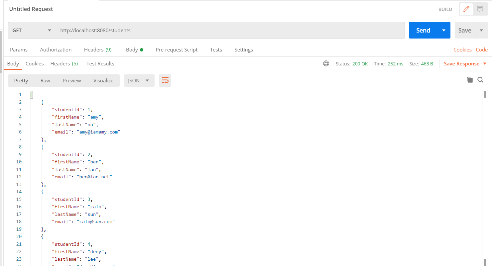

# Spring Boot MVC Demo
<ul>
  <li>Demo for using Spring Boot MVC to build RESTful CRUD API and JSP Web Application</li>
  <li>Use Student Model to demonstrate how to Create, Read, Update, and Delete Student Object</li>
  <li>H2 database is used to store and access data</li>
</ul>

<h3> Get all students (top:API, bottom:JSP) </h3>

<h3> Get a student (top:API, bottom:JSP) </h3>

<h3> Post new student (top:API, bottom:JSP) </h3>

<h3> Update a student (top:API, bottom:JSP) </h3>

<h3> Delete a student (top:API, bottom:JSP) </h3>

